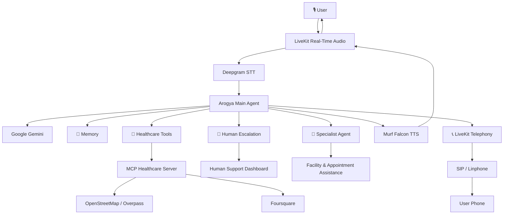

# Arogya Health Access 🩺

A voice-first healthcare assistant built for the **10 Days of Voice Agents — VoiceForBharat Edition** by [Murf AI](https://www.linkedin.com/company/murf-ai/).

Arogya is designed to make healthcare information and assistance more accessible through natural, real-time voice conversations.

It combines multilingual voice interaction, memory, live healthcare data, outbound calls, human escalation, call analytics, and specialist agent handoffs.

**Powered by Murf Falcon, LiveKit, Gemini, Deepgram, Next.js, React, MCP, OpenStreetMap and Foursquare.**

---

## The Problem

Accessing healthcare information can be difficult when users have to rely entirely on typing, navigate multiple services, or communicate in a language they are less comfortable using.

Arogya takes a **voice-first approach** to healthcare access.

The goal is not to replace healthcare professionals or provide medical diagnosis. Instead, Arogya helps users interact with healthcare information more naturally, find relevant healthcare facilities, receive reminders, and reach human support when an AI assistant should not handle the request alone.

Voice is particularly useful for users who may prefer speaking over typing, including users communicating in Indian languages or through mixed-language conversations.

---

## What is Arogya?

Arogya Health Access is a voice-first healthcare assistant designed to make healthcare information and assistance more accessible through natural voice conversations.

Arogya can:

- 🎙️ Have real-time voice conversations
- 🌐 Understand multilingual and code-mixed conversations
- 🧠 Remember useful information for returning users with consent
- 🔧 Find nearby healthcare facilities using live external data
- 📍 Use device location to improve healthcare facility searches
- 📞 Make outbound healthcare reminder calls
- 🤝 Escalate sensitive or high-risk requests to human support
- 📊 Track human-support requests through a dashboard
- 🏥 Hand facility and appointment conversations to a specialist agent
- 🔄 Transfer conversations between the main and specialist agents while preserving context
- ⚡ Provide a low-latency conversational experience using Murf Falcon

---

## Key Features

### 🎙️ Real-Time Voice Interaction

Arogya uses a real-time voice pipeline combining speech-to-text, an LLM, text-to-speech and LiveKit for audio transport.

[Murf Falcon](https://murf.ai/api/docs/text-to-speech-models/falcon-2) powers the voice output.

### 🌐 Multilingual & Code-Mixed Conversations

Arogya can automatically detect the user's language and respond in the same language.

The agent is instructed to maintain the detected language instead of unnecessarily translating or switching languages during a conversation.

### 🧠 Memory & Personalisation

Arogya supports:

- User identification
- Persistent user memory
- Conversation history
- Temporary in-session memory
- Returning-user personalisation
- Post-call memory consent
- Save / Discard memory controls

Persistent conversation memory is only saved when the user explicitly gives consent.

### 🔧 Healthcare Tools

Arogya can use external tools instead of relying entirely on generated information.

The healthcare facility lookup uses an **MCP server** and live OpenStreetMap data to provide:

- Nearby hospitals and clinics
- PHCs and other healthcare facilities
- Distance information
- Facility addresses when available
- Public / government facility tagging when available
- Google Maps links
- Data fetch timestamps

The system also includes graceful failure handling when an external data source is unavailable and a fallback Overpass endpoint for improved reliability.

### 📞 Outbound Healthcare Calls

Arogya can proactively call users instead of only responding to incoming conversations.

The outbound calling system supports:

- Scheduled healthcare reminders
- Dynamic reminder purposes
- Two-way conversations
- User-controlled call termination
- Call opt-out handling
- Multilingual speech
- Native-script support

Outbound calling uses LiveKit Telephony with SIP and Linphone.

### 🤝 Human Escalation

A healthcare assistant should know when **not** to answer.

Arogya can escalate requests involving:

- Red-flag symptoms
- Diagnosis requests
- Situations requiring human assistance

Before creating an escalation, Arogya asks for permission to share the relevant information.

The escalation system:

- Creates a human-support request
- Generates a unique reference ID
- Produces a concise human-readable summary
- Protects sensitive information such as OTPs, PINs, passwords and account numbers
- Provides a Human Support Dashboard
- Supports ticket states from Open → In Progress → Resolved

### 🏥 Specialist Agent Handoff

Instead of putting every healthcare capability into one large agent, Arogya uses a dedicated **Clinic & Appointment Specialist Agent**.

The specialist handles:

- Hospitals
- Clinics
- Doctors
- Healthcare facilities
- Appointment-related queries
- Facility comparison
- Healthcare specialty searches
- User tips and feedback

The main agent can hand the conversation to the specialist when required while preserving the existing conversation context.

The specialist can also hand the conversation back to Arogya when the user changes to a general healthcare topic.

---

## Architecture



### Core Voice Pipeline

```text
User Voice
    ↓
LiveKit
    ↓
Deepgram Speech-to-Text
    ↓
Arogya Agent + Gemini
    ↓
Tools / Memory / Escalation / Specialist Handoff
    ↓
Murf Falcon Text-to-Speech
    ↓
LiveKit
    ↓
User Voice
```

---

## Tech Stack

### Backend

- Python
- LiveKit Agents
- LiveKit Telephony
- Google Gemini
- Deepgram
- Murf Falcon
- MCP
- SQLite
- Silero

### Frontend

- Next.js
- React
- TypeScript
- Tailwind CSS
- LiveKit Components

### Healthcare Data

- [OpenStreetMap](https://www.openstreetmap.org/)
- [Overpass API](https://overpass-api.de/)
- [Nominatim](https://nominatim.org/)
- Foursquare

### Communication

- LiveKit
- SIP
- Linphone

---

## 10 Days of Voice Agents Journey

### Day 1 – The Foundation 🎙️

Built the foundation of Arogya Health Access as a voice-first healthcare assistant.

- Set up the LiveKit voice agent
- Connected speech-to-text, LLM and text-to-speech
- Configured Murf Falcon for voice responses
- Created the initial healthcare-focused system prompt
- Established real-time voice conversations

**Built with:** LiveKit Agents, Deepgram, Gemini and Murf Falcon

---

### Day 2 – Voice & Multilingual Experience 🌐

Focused on making Arogya more accessible through multilingual voice interaction.

- Added multilingual voice interaction
- Configured speech recognition for multiple languages
- Added language-aware responses
- Improved the voice conversation experience
- Connected the voice agent with the frontend

**Built with:** LiveKit, Deepgram, Gemini and Murf Falcon

---

### Day 3 – Personalised Healthcare UI 🎨

Focused on the frontend and user experience of Arogya.

- Built a custom healthcare-focused homepage
- Added a 5-language interface
- Created a voice-first conversation interface
- Added real-time conversation transcripts
- Added connecting and active conversation states
- Designed the interface around a healthcare use case

The UI was structured so individual visual elements and interactions can be extended in future iterations.

**Built with:** Next.js, React, TypeScript, Tailwind CSS and LiveKit Components

---

### Day 4 – Agent Memory 🧠

Taught Arogya to remember useful information from previous conversations.

- Added user identification
- Added persistent user memory
- Added conversation history
- Added temporary in-session memory
- Added returning-user personalisation
- Added post-call memory consent
- Added Save / Discard memory flow

Arogya only persists the current conversation when the user explicitly gives consent.

**Built with:** Python, SQLite, LiveKit Agents, Next.js, React and TypeScript

---

### Day 5 – The Tools 🔧

Taught Arogya to use external tools and retrieve real-world healthcare data.

Built a healthcare facility lookup using an **MCP server** and live OpenStreetMap data.

- Added browser device-location detection
- Resolved device coordinates to the user's district
- Chained location information into the healthcare lookup
- Built an MCP healthcare server
- Added the `find_nearby_health_facilities` tool
- Connected the MCP tool directly to the voice agent
- Retrieved live healthcare facility data from OpenStreetMap
- Added distance calculation
- Added facility addresses when available
- Added public / government facility tagging when available
- Added Google Maps links
- Added data fetch timestamps
- Pushed healthcare results to the frontend while the agent speaks
- Added graceful failure handling when the external data source is unavailable
- Added a fallback Overpass endpoint for improved reliability

The healthcare data is **live**, rather than a hand-built local dataset.

**Built with:** Python, MCP, LiveKit Agents, OpenStreetMap, Overpass API, Nominatim, Next.js, React, TypeScript, Tailwind CSS, Gemini, Deepgram and Murf Falcon

---

### Day 6 – Outbound Calls 📞

Taught Arogya to proactively call the user instead of only responding to incoming conversations.

- Added outbound calling using LiveKit Telephony
- Integrated Linphone through SIP
- Added scheduled healthcare reminder calls
- Added dynamic reminder purposes
- Added two-way conversation after the call connects
- Added support for continuing the conversation during reminder calls
- Added user-controlled call termination
- Added opt-out handling
- Kept multilingual speech and native-script support for outbound calls

Arogya can now proactively call the user, deliver the requested healthcare reminder, and continue the conversation naturally over the phone.

**Built with:** Python, LiveKit Agents, LiveKit Telephony, SIP, Linphone, Murf Falcon, Deepgram, Google Gemini and Silero

---

### Day 7 – Human Help & Escalation 🤝

Taught Arogya to recognize when a healthcare request should be handled by a human instead of trying to solve everything on its own.

- Added human escalation for red-flag symptoms
- Added escalation for diagnosis requests
- Added a `create_escalation` tool
- Added permission-based information sharing
- Added concise human-readable summaries
- Added protection against sharing sensitive information such as OTPs, PINs, passwords and account numbers
- Added unique escalation reference IDs
- Added a Human Support Dashboard
- Added ticket status management from Open to In Progress to Resolved
- Added automatic dashboard updates
- Tested both escalation and normal conversation paths

Arogya can recognize when human support is needed, ask the caller for permission before sharing information, create a support request, provide a reference ID, and give the support team a clear workflow.

**Built with:** Python, LiveKit Agents, Next.js, React, SQLite, MCP, Murf Falcon, Deepgram, Google Gemini and Silero

---

### Day 8 – Multilingual & Low-Latency Voice Experience 🌐⚡

Improved Arogya to make healthcare conversations more accessible across languages while reducing unnecessary response delays.

- Added automatic language detection
- Added language-aware responses that mirror the user's language
- Added support for multilingual and mixed-language conversations
- Updated agent instructions to maintain the detected language
- Prevented unnecessary language switching or translation
- Optimized the voice-agent flow to reduce response latency
- Improved conversation responsiveness
- Tested language handling and latency improvements

Arogya can now communicate naturally in the user's preferred language while providing a faster and more responsive voice experience.

**Built with:** Python, LiveKit Agents, Next.js, React, SQLite, MCP, Murf Falcon, Deepgram, Google Gemini and Silero

---

### Day 9 – Specialist Agent & Smart Handoff 🏥🤝

Made Arogya more modular by introducing a dedicated **Clinic & Appointment Specialist Agent**.

- Created a separate specialist agent for hospitals, clinics, doctors, healthcare facilities and appointment-related queries
- Added intelligent handoff from the main Arogya agent
- Passed existing conversation context during handoff
- Added reverse handoff back to Arogya
- Added Foursquare integration alongside OpenStreetMap
- Added facility details and healthcare specialty search
- Added user tips and feedback
- Added facility comparison
- Added structured large-data display for facility and nutrition information
- Kept Arogya focused on general healthcare
- Tested normal conversations and specialist handoff flows

Arogya can now **decide when to handle a request itself and when to delegate it to a specialist**, creating a more scalable multi-agent healthcare experience.

**Built with:** Python, LiveKit Agents, Next.js, React, SQLite, MCP, Murf Falcon, Deepgram, Google Gemini, Silero, OpenStreetMap and Foursquare

---

## Why Murf Falcon?

[Murf Falcon](https://murf.ai/api/docs/text-to-speech-models/falcon-2) was used as the text-to-speech layer for Arogya.

Key characteristics highlighted during the challenge include:

- **55ms model latency**
- **130ms time-to-first-audio**
- **$0.01 / 1000 characters**
- **150+ voices**
- **35+ languages**
- **99.38% pronunciation accuracy**

Murf Falcon was especially important for keeping the voice interaction responsive and making the agent suitable for multilingual conversations.

---

## Challenges & Learnings

### 1. Maintaining Language Consistency

A multilingual voice agent can easily become inconsistent if language detection and agent instructions are not aligned.

The challenge was preventing Arogya from unnecessarily switching languages or translating a conversation when the user was already communicating naturally.

The solution was to detect the user's language and explicitly instruct the agent to maintain the detected language throughout the conversation.

### 2. Making Healthcare Data Reliable

Healthcare facility information should not simply be generated by an LLM.

Arogya therefore uses an MCP healthcare server connected to live external data sources.

External APIs can still fail, so the system includes graceful failure handling and a fallback Overpass endpoint.

This reinforced an important lesson:

> Tool-using agents need failure paths just as much as successful paths.

### 3. Knowing When Not to Answer

Healthcare is a domain where an AI assistant should not attempt to solve every request.

Arogya therefore includes human escalation for red-flag symptoms and diagnosis-related requests.

The escalation flow also asks for permission before sharing relevant information and removes sensitive credentials such as OTPs, PINs and passwords from the information shared with human support.

### 4. Managing a Growing Agent

As more capabilities were added, putting every responsibility inside one agent became less practical.

The specialist-agent architecture solved this by giving the Clinic & Appointment Specialist a smaller and well-defined responsibility.

Conversation context can be passed during handoff, while the main agent remains focused on general healthcare assistance.

### 5. Balancing Voice and Visual Information

Not everything is efficient to communicate through speech.

Large facility lists, comparisons and structured information can become difficult to listen to line by line.

Arogya therefore combines voice interaction with frontend components that can display structured information visually.

---

## Getting Started

### Prerequisites

- Python 3.10+
- Node.js 18+
- [uv](https://docs.astral.sh/uv/)
- [pnpm](https://pnpm.io/)
- A [LiveKit Cloud](https://cloud.livekit.io/) project
- Murf API key
- Deepgram API key
- Google Gemini API key

### Install uv

**macOS/Linux:**

```bash
curl -LsSf https://astral.sh/uv/install.sh | sh
```

**Windows PowerShell:**

```powershell
powershell -ExecutionPolicy ByPass -c "irm https://astral.sh/uv/install.ps1 | iex"
```

### Install pnpm

```bash
npm install -g pnpm
```

---

## Environment Variables

Never commit API keys or secrets to GitHub.

Create the required environment files using the project's `.env.example` files.

Example:

```env
LIVEKIT_URL=your_livekit_url
LIVEKIT_API_KEY=your_livekit_api_key
LIVEKIT_API_SECRET=your_livekit_api_secret

MURF_API_KEY=your_murf_api_key
DEEPGRAM_API_KEY=your_deepgram_api_key
GOOGLE_API_KEY=your_google_api_key
```

Replace the placeholder values with your own credentials.

**Never publish:**

- API keys
- API secrets
- SIP credentials
- Phone numbers
- Caller information
- Private healthcare or user data

---

## Installation

### Step 1 — Clone the Repository

```bash
git clone YOUR_GITHUB_REPOSITORY_URL
cd YOUR_REPOSITORY_NAME
```

### Step 2 — Install Backend Dependencies

```bash
cd backend
uv sync
uv run python src/agent.py download-files
```

### Step 3 — Install Frontend Dependencies

```bash
cd ../frontend
pnpm install
```

---

## Running the Project

### Option A — Start Everything

From the repository root:

**macOS/Linux**

```bash
chmod +x start_app.sh
./start_app.sh
```

**Windows PowerShell**

```powershell
.\start_app.ps1
```

### Option B — Run Services Separately

**Terminal 1 — LiveKit**

```bash
livekit-server --dev
```

**Terminal 2 — Backend Agent**

```bash
cd backend
uv run python src/agent.py dev
```

**Terminal 3 — Frontend**

```bash
cd frontend
pnpm dev
```

Then open:

```text
http://localhost:3000
```

Allow microphone access and start a conversation with Arogya.

---

## Testing the Agent

A simple first test is:

> "Hello Arogya, I need help finding a healthcare facility near me."

The expected flow is:

```text
User speaks
    ↓
Speech is transcribed
    ↓
Arogya understands the request
    ↓
Location/tool information is processed
    ↓
Healthcare facility data is retrieved
    ↓
Arogya responds through voice
    ↓
Relevant results are displayed in the frontend
```

### Multilingual Conversation

Speak in one of the supported languages or use a mixed-language conversation and verify that Arogya maintains the detected language.

### Memory

Provide information during a conversation, give the required consent, and test whether the information is available during a returning-user interaction.

### Human Escalation

Test a request that should be escalated and verify:

- Permission is requested
- Sensitive information is protected
- An escalation reference ID is generated
- The request appears in the Human Support Dashboard

### Specialist Handoff

Ask about a healthcare facility or appointment and verify that the conversation is handed to the Clinic & Appointment Specialist Agent without requiring the user to repeat the context.

### Outbound Calls

Test a configured healthcare reminder and verify that the outbound call connects and supports a two-way conversation.

---

## Project Structure

```text
YOUR_REPOSITORY/
├── backend/
│   ├── src/
│   │   └── agent.py
│   ├── tests/
│   ├── .env.example
│   └── pyproject.toml
│
├── frontend/
│   ├── app/
│   ├── components/
│   ├── public/
│   ├── .env.example
│   └── package.json
│
├── start_app.sh
├── start_app.ps1
├── README.md
└── ...
```

---


### GitHub Repository

[View the Arogya Health Access Repository](https://github.com/Kumar-nm/murf-livekit-starter)


### Challenge Journey

- [Day 1 – Foundation](https://www.linkedin.com/posts/kumarnm2004_voiceforbharat-voiceforbharat-murfai-activity-7491142016182116353-d3e1?utm_source=share&utm_medium=member_desktop&rcm=ACoAAENEqDQBB14-rq4TXaUCRRz77dlvWmXOEek)
- [Day 2 – Voice & Multilingual Experience](https://www.linkedin.com/posts/kumarnm2004_voiceforbharat-voiceforbharat-murfai-activity-7491518479939018752-uEpI?utm_source=share&utm_medium=member_desktop&rcm=ACoAAENEqDQBB14-rq4TXaUCRRz77dlvWmXOEek)
- [Day 3 – Personalised Healthcare UI](https://www.linkedin.com/posts/kumarnm2004_10daysofvoiceagents-voiceforbharat-murffalcon-activity-7491889318957879296-wdtQ?utm_source=share&utm_medium=member_desktop&rcm=ACoAAENEqDQBB14-rq4TXaUCRRz77dlvWmXOEek)
- [Day 4 – Agent Memory](https://www.linkedin.com/posts/kumarnm2004_10daysofvoiceagents-voiceforbharat-murffalcon-activity-7492214936828346368-aQ4P?utm_source=share&utm_medium=member_desktop&rcm=ACoAAENEqDQBB14-rq4TXaUCRRz77dlvWmXOEek)
- [Day 5 – Healthcare Tools](https://www.linkedin.com/posts/kumarnm2004_10daysofvoiceagents-voiceforbharat-murffalcon-activity-7492594436972142592-rKmm?utm_source=share&utm_medium=member_desktop&rcm=ACoAAENEqDQBB14-rq4TXaUCRRz77dlvWmXOEek)
- [Day 6 – Outbound Calls](https://www.linkedin.com/posts/kumarnm2004_10daysofvoiceagents-voiceforbharat-murffalcon-activity-7492981533398573057-gWMO?utm_source=share&utm_medium=member_desktop&rcm=ACoAAENEqDQBB14-rq4TXaUCRRz77dlvWmXOEek)
- [Day 7 – Human Escalation](https://www.linkedin.com/posts/kumarnm2004_10daysofvoiceagents-voiceforbharat-murffalcon-activity-7493341200746369025-UuJd?utm_source=share&utm_medium=member_desktop&rcm=ACoAAENEqDQBB14-rq4TXaUCRRz77dlvWmXOEek)
- [Day 8 – Multilingual & Low-Latency Experience](https://www.linkedin.com/posts/kumarnm2004_10daysofaivoiceagents-10daysofvoiceagents-activity-7493669151685804033-l2UB?utm_source=share&utm_medium=member_desktop&rcm=ACoAAENEqDQBB14-rq4TXaUCRRz77dlvWmXOEek)
- [Day 9 – Specialist Agent & Smart Handoff](https://www.linkedin.com/posts/kumarnm2004_10daysofaivoiceagents-10daysofvoiceagents-activity-7494024763665920000-mgvX?utm_source=share&utm_medium=member_desktop&rcm=ACoAAENEqDQBB14-rq4TXaUCRRz77dlvWmXOEek)

---

## What I Would Improve Next

Arogya is a challenge project, but there are several areas that could be developed further:

- Expand healthcare data coverage across more regions
- Add more Indian languages
- Improve real-world latency evaluation
- Add more robust automated voice-agent evaluation
- Improve specialist routing
- Add stronger production authentication and authorization
- Expand healthcare facility and appointment integrations
- Improve analytics and call-quality metrics
- Perform broader safety testing with realistic healthcare scenarios
- Add stronger observability for production deployments

---

## Disclaimer

Arogya Health Access is an experimental voice-agent project built for the **10 Days of Voice Agents — VoiceForBharat Edition**.

It is intended to assist users with healthcare information and access-related workflows.

It is **not a replacement for a qualified healthcare professional and should not be used for medical diagnosis or emergency medical decision-making.**

---

## Links & Resources

- [Murf API Documentation](https://murf.ai/api/docs)
- [Murf Falcon Documentation](https://murf.ai/api/docs/text-to-speech-models/falcon-2)
- [Murf Voice Library](https://murf.ai/api/docs/voices-styles/voice-library)
- [LiveKit Documentation](https://docs.livekit.io/)
- [LiveKit Voice AI Quickstart](https://docs.livekit.io/agents/start/voice-ai/)
- [Deepgram Documentation](https://developers.deepgram.com/)
- [OpenStreetMap](https://www.openstreetmap.org/)
- [MCP Documentation](https://modelcontextprotocol.io/)

---

## 10 Days of Voice Agents — VoiceForBharat Edition 🎙️🇮🇳

Built as part of the **10 Days of Voice Agents — VoiceForBharat Edition** by Murf AI.

The project started as a basic voice assistant and evolved into a more complete healthcare voice system with:

**Voice → Memory → Tools → Calls → Human Support → Analytics → Specialist Handoff**

The biggest lesson from the challenge was that building a useful voice agent is not only about making it speak.

It is about giving the agent the right **context, tools, boundaries, memory, failure handling and escalation paths** to make the interaction useful and responsible.

---

## License

MIT
